# BASIC POSTGRESQL APPLICATION VIA GOLANG

In this study, I will try to introduce the simplest postgreSQL applicaiton using the Golang programming language. Intermediate level knowledge of Golang language will be sufficient.

> ## Working environment
>
> - Debian Operating System
> - Golang sw language
> - PostgreSQL
> - DBeaver
> - VS Code 

## General hierarchy of the project
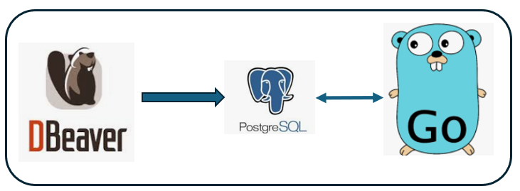


## Dbeaver database table creation

### Step 1
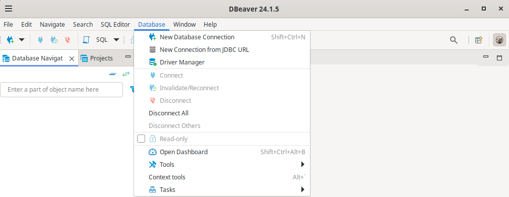

### Step 2
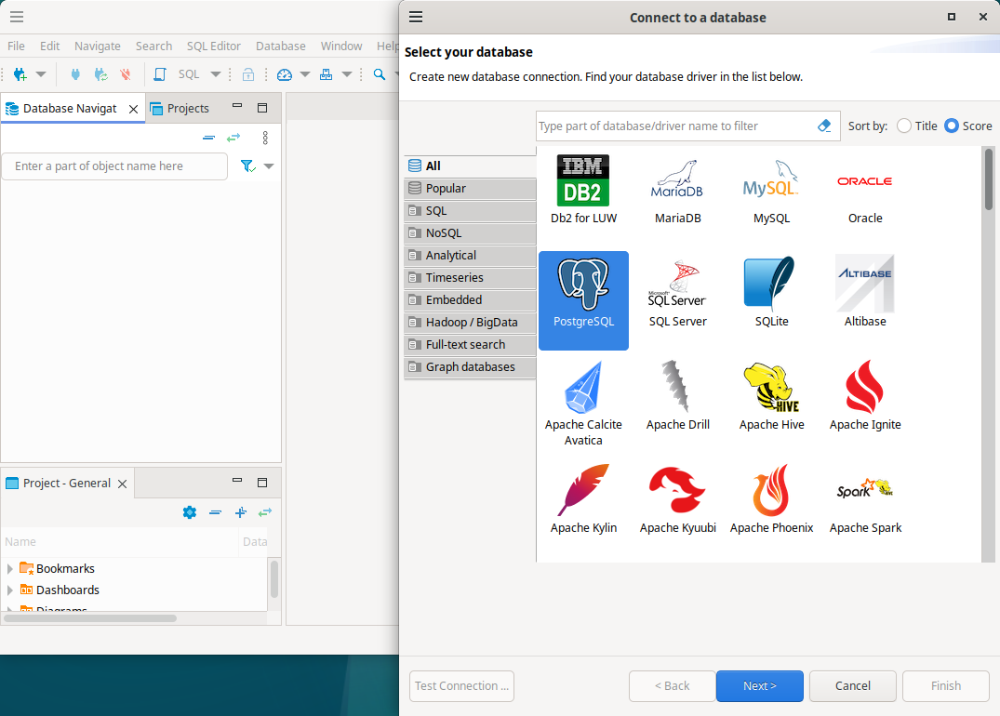

### Step 3
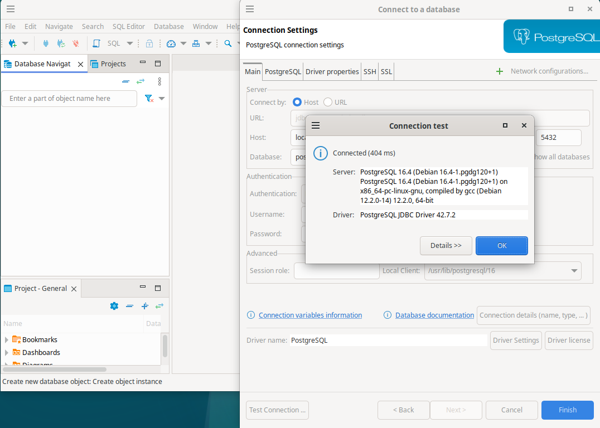

### Step 4
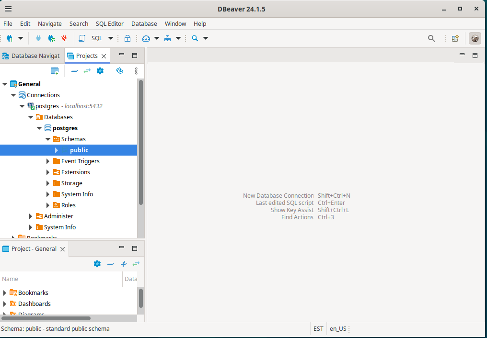

### Step 5
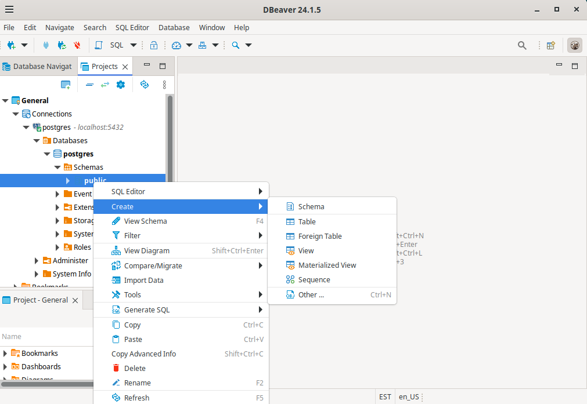

### Step 6
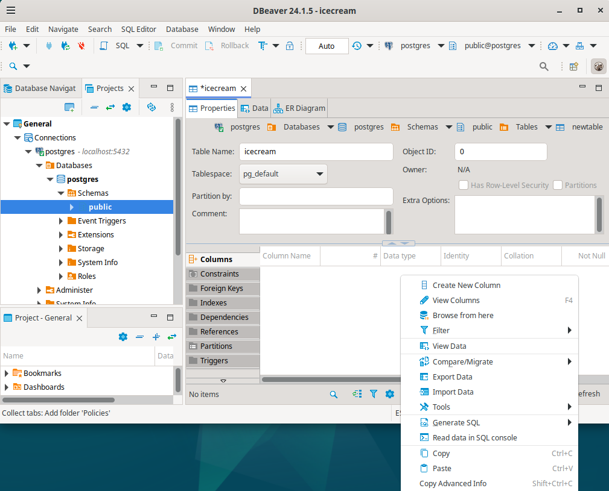

### Step 7
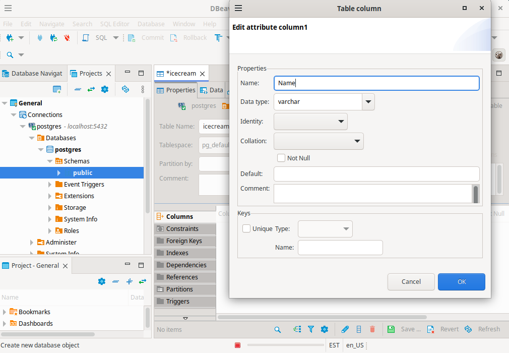

### Step 8


### Step 9


### Step 10
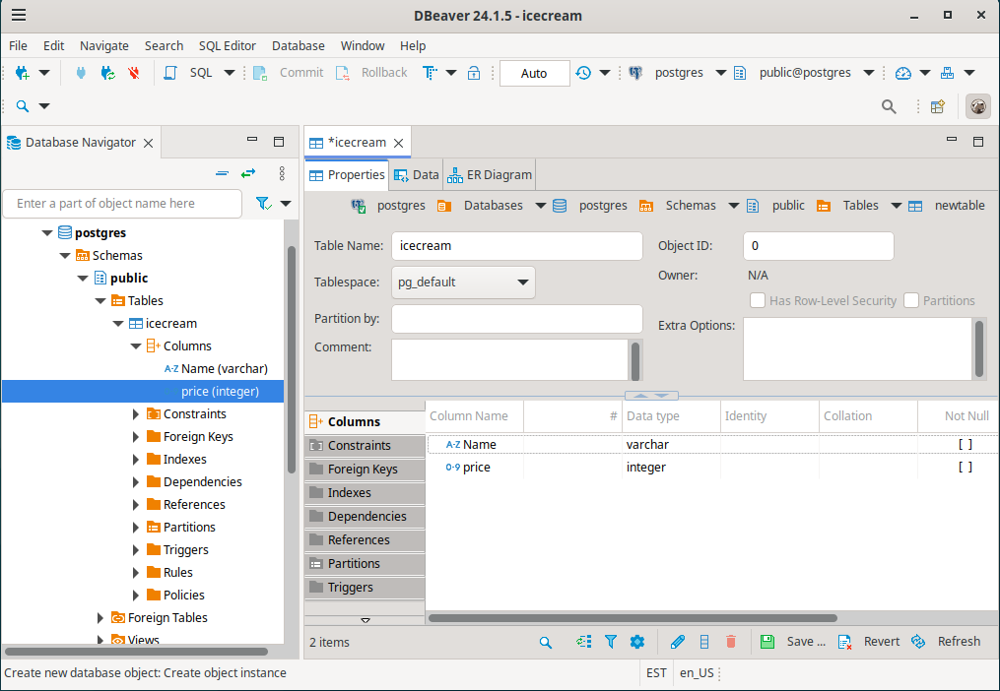

### Step 11
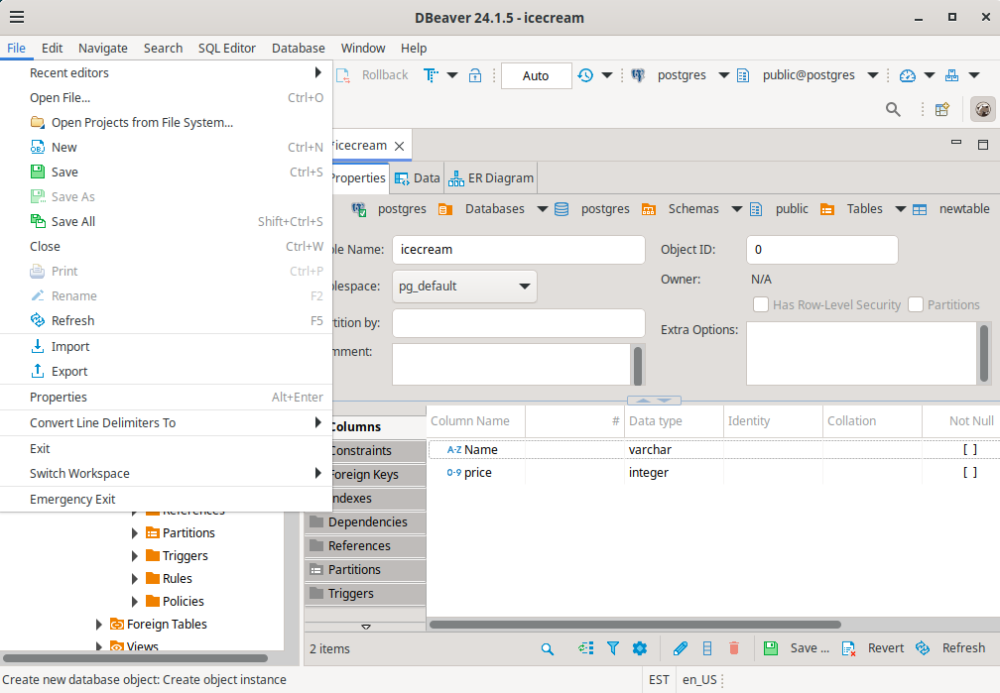

### Step 12
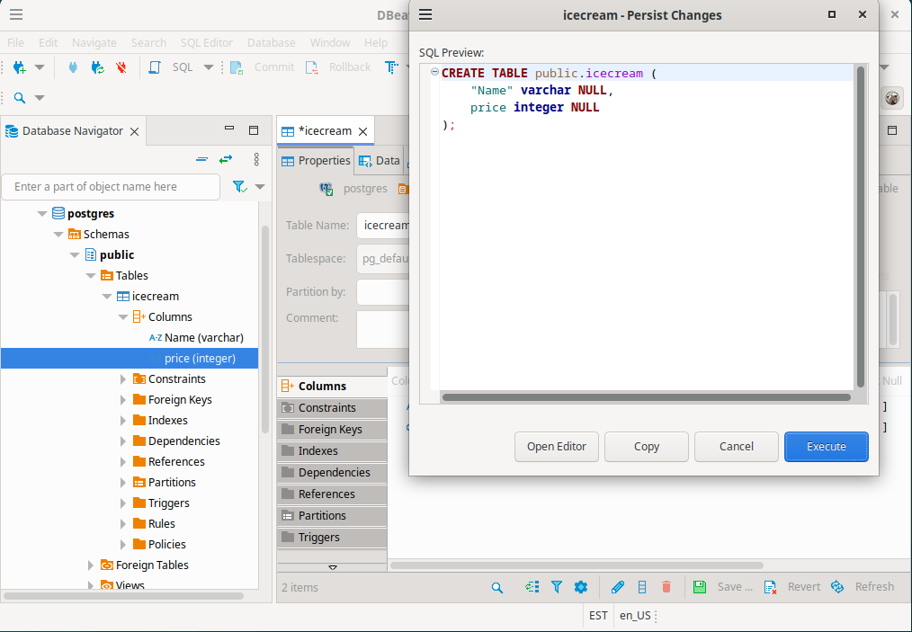

### Step 13
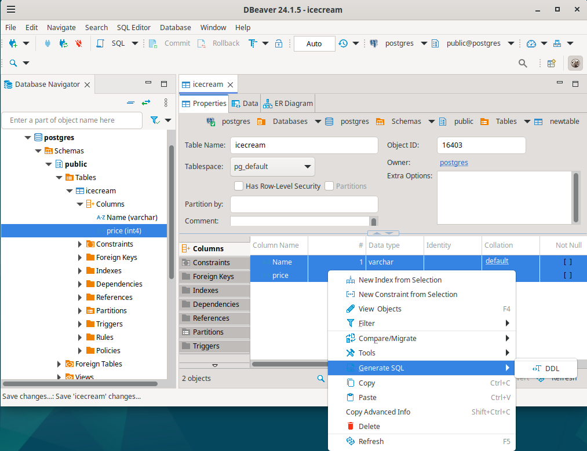


Now our Database table is ready !
Lets insert some values to it via Golang.


## VS code
```
package main

import (
	"database/sql"
	"fmt"

	_ "github.com/lib/pq"
)

const (
	user     = "postgres"
	password = "1234"
	dbname   = "postgres"
	host     = "localhost"
	port     = 5432
)

func main() {
	// Connection to database
	psqlconn := fmt.Sprintf("host=%s port=%d user=%s password=%s dbname=%s sslmode=disable", host, port, user, password, dbname)
	// Open the database
	db, err := sql.Open("postgres", psqlconn)
	if err != nil {
		panic(err)
	}
	fmt.Println("Database Connected!")
	// Close the database
	defer db.Close()
	insert := `insert into "icecream"("Name", "Price") values($1, $2)`
	// insert new raw to database table
	_, err = db.Exec(insert, "Vanilla", 4)
	if err != nil {
		panic(err)
	}
	_, err = db.Exec(insert, "Chocolate", 5)
	if err != nil {
		panic(err)
	}
	fmt.Println("Writing to database completed!")
}
```

## Run go file
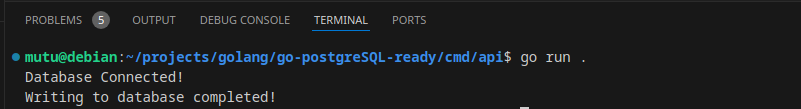

## Database table result
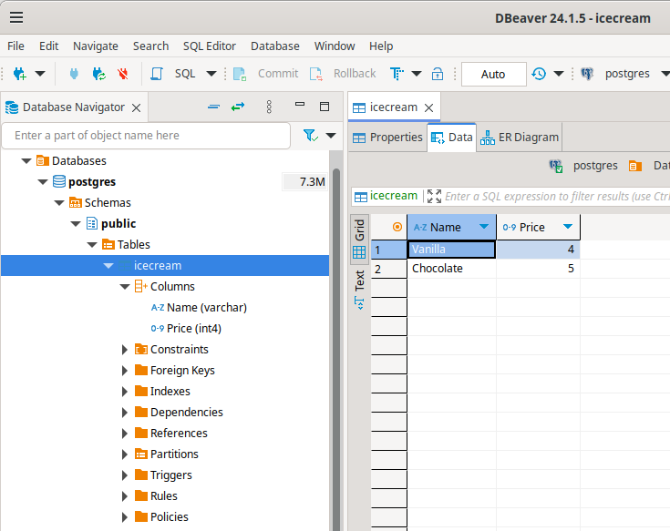


## Github source code

[github_source_code](https://github.com/MuratTunc/go-postgreSQL-ready.git)

__**I wish you good coding, thinking that it is educational and fun.**__
